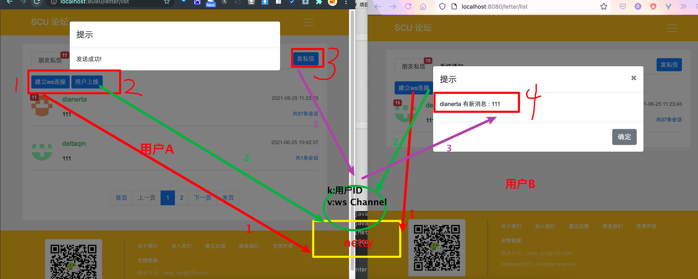

#  校园综合平台

## 部署
```
git clone https://github.com.cnpmjs.org/delta-qin/scu-integrated-platform-SSM.git

cd es/
mkdir -p plugins/ik
cd ik
wget https://github.91chifun.workers.dev/https://github.com//medcl/elasticsearch-analysis-ik/releases/download/v6.4.3/elasticsearch-analysis-ik-6.4.3.zip
unzip ...
rm -f e...
```
es ik文件夹


## 必要性
- 现有平台难找不纯粹，安全机制不完善
- 基本没人维护

## 核心业务流程

## 核心功能模块架构

## 数据如何存储

## 使用到的中间件技术


## 项目技术
| 技术            | 使用                                                         |      |
| --------------- | ------------------------------------------------------------ | ---- |
| SpringBoot      | 项目框架搭建                                                 |      |
| SpringMail      | 注册邮件校验                                                 |      |
| Mybatis         | 持久层框架                                                   |      |
| Spring Secutiry | 用户鉴权控制<br />（认证是自己登录实现，授权直接使用数据库查询权限） |      |
| caffeine        | 本地缓存                                                     |      |
| Mysql           | 数据库                                                       |      |
| Redis           | 实现点赞的数据的存储，以及用户信息和用户登录凭证的存储       |      |
| Kafka           | 实现消息的通知，异步解耦                                     |      |
| ElasticSearch   | 所有的文字的搜索，按照热度排序（热度有时间和用户评论点赞综合因素） |      |
| Quartz          | 定时任务，用于计算文章的分数也就是热度（会去Redis查找是否有任务） |      |
| MongoDB         | 存放评论的数据                                               |      |
| netty           | 借助内置的websocket实现消息实时接收（全双工）                |      |


## 项目进度

### v1.0 基于牛客高级项目的基本实现 (已完成)
- 游客
    - 浏览帖子
- 用户
    - 发布帖子。评论。回复。私信
    - 点赞。关注用户
- 版主
    - 加精。置顶帖子
- 管理员
    - 删除帖子

使用的技术：kafka、ES、MySQL、Redis、Caffeine、Spring Security、Quartz、Spring Mail、Mybatis、SpringBoot
    
#### 为什么使用消息队列存储新消息而不是数据库
用户的通知消息和新通知提醒数据都放在数据库中，数据库的读写操作频繁，尤其是新消息表，访问压力大。
通知消息还在数据库，因为需要持久化，新消息转移到消息队列，快速而且可以实现**异步**落库消息

### v2.0  MongoDB 替换 MySQL 存储评论 (已完成)

使用的技术：MongoDB

#### 为什么
文章评论两项功能存在以下特点：数据量大，写入操作频繁，价值较低。对于这样的数据，我们更适合使用MongoDB来实现数据的存储

MongoDB是一个基于分布式文件存储的数据库。由C++语言编写。旨在为WEB应用提供可扩展的高性能数据存储解决方案。 MongoDB是一个介于关系数据库和非关系数据库之间的产品，是非关系数据库当中功能最丰富，最像关系数据库的。它支持的数据结构非常松散，是类似json的bson格式，因此可以存储比较复杂的数据类型。

[](note/v2.0使用mongoDB改进.md)

### v3.0 ， 使用websocket + netty 替换项目的私信和系统通知功能，同时实现文章订阅功能（基本实现，使用模板引擎有点问题，一刷新websocket就断开，需要重新连接）

#### 为什么？基于db实现的通知系统存在的问题

- 一开始私信和系统通知是使用消息队列异步消费到数据库或者Redis里面，用户自己手动刷新才可以看到新消息
- 使用websocket + netty的方式只要用户在线（websocket连接建立），即使用户不刷新，也可以得到新消息的提示

消息发送者，消息存储，消息接收者，新消息提醒机制
- 以前的系统：消息真正的发送者是消息通知系统，而非操作者。用户提前为系统设定好规则，系统按照规则发送消息。

####  如何实现：netty的websocket连接池 全双工通信（基本实现）
- 上线是向系统索取一次：和之前一样，还是去数据库取
- 在线时系统向接收者主动推送：消息队列消费的时候不仅仅是存到数据库，还要将对应连接从netty的连接池取出来接收者的websocket连接。之后netty将通过接收者的websocket返回新消息


编写NettyServer，启动Netty服务。使用配置Bean创建Netty服务。
编写NettyConfig。
编写和WebSocket进行通讯处理类MyWebSocketHandler，进行MQ和WebSocket的消息处理。

- 目前实现：进入私信页面，首先建立ws连接，之后发送当前用户的信息，将用户ID和Channel绑定，有新消息的时候，mq消费的时候会检测当前已经登录的用户有没有自己要通知的，有的话就发一个ws消息，而且不管有么有ws连接都会存到数据库
- 存在的问题：只要刷新就会断开连接，必须重新建立ws，重新注册用户和Channel的映射关系。因为切换页面必然会导致页面刷新，暂时没有想到解决办法。
- 目前想到的解决办法，使用Vue单页面引用开发，前后分离，是局部刷新，就不会导致ws断开。在组件加载的时候连接websocket，在组件销毁的时候断开websocket



#### 一开始的消息异步单纯消费到数据库用户刷新适合不紧急 （文章订阅功能,已经实现）
- 比如说用户刷新页面才去看看有没有什么自己关注的新的消息
- 这个功能之前实现关注，但是没实现文章更新提醒（关注是在Redis里面互相关注的）

新增文章群发消息：发文章的时候发一个广播主题的消息，消费者受到消息之后，获取到需要通知的粉丝之后，放到数据库里面就好，不需要立马发到前端
#### 修复自己赞自己也会收到通知（已实现）
消费的时候判断一下，是自己的就不消息了

### v4.0 ， 使用DDD领域模型（充血）对项目重构

## 项目结构
```
.
├── README.md
├── Solution.md
├── scu-application 应用层
├── scu-common 公共
├── scu-domain 领域层
├── scu-infrastructure 基础设施层
├── scu-interfaces rpc接口层 + 参数校验（设计在这里rest也可以使用）
├── scu-protal rest接口层
└── scu-starter 启动器

```

## 项目运行

只需要启动starter里面的项目即可

## 项目部署

[部署文档](deploy.md) 

## 压力测试

[压测项目](jmeter) 

## 常见问题


## 设计
- 点赞和评论都有可能针对文章和评论，为了区分二者又为了少写代码，直接抽象为实体，1表示文章，2表示评论，ID就是对应的ID直接传递即可，这样虽然多了一个字段，但是只需要一份代码
- 拦截器填充ThreadLocal 实现用户信息的使用
- 校验信息，生成登录凭证到Redis，后面拦截器会使用凭证验证用户是否登录，如果登录了还会将用户的信息设置到security，方便授权。所以登录是使用自己的，授权使用的是security
- 消息 + kafka 实现ES的数据同步
- 图片云服务，生成分享是服务器上传，上传头像是客户端上传

## 参考
- forum-java：项目结构设计
- 牛客网高级项目：前端页面，后端部分逻辑
- 十次方论坛项目：MongoDB 以及 websocket+netty
