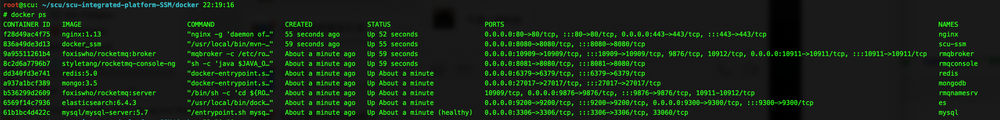
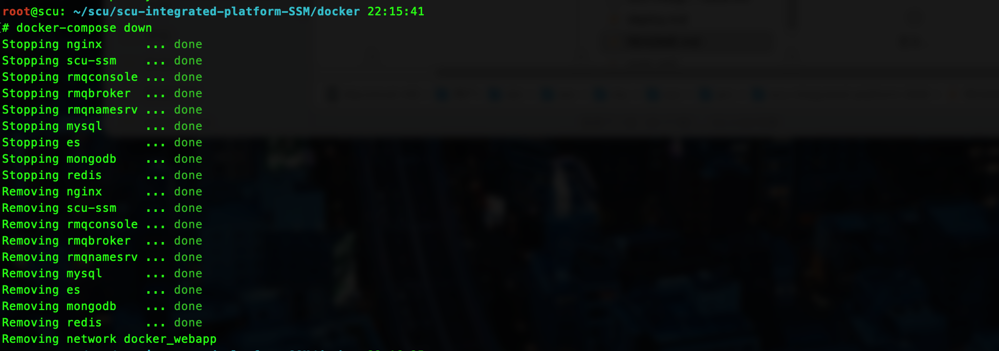
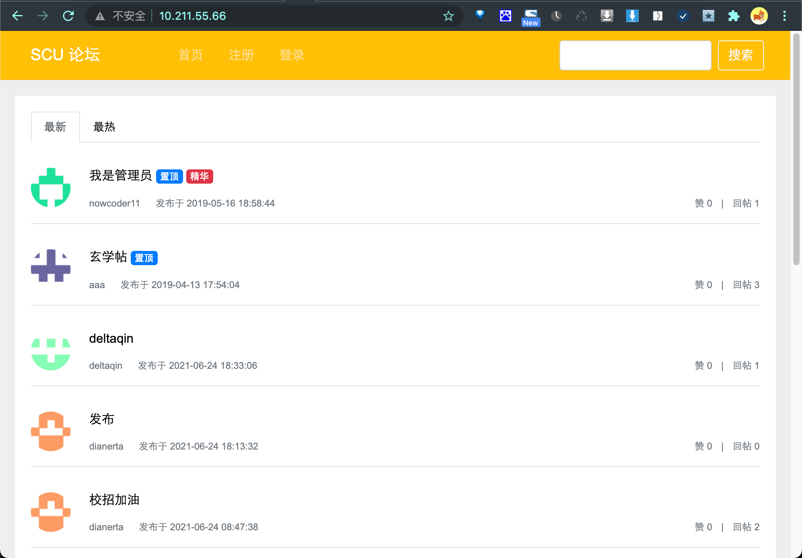

#  校园综合平台

> 欢迎提出修改建议以及实现思路！！！

**校园论坛项目。包括发帖，点赞评论，热门搜索，聊天室，私信，关注通知。。。**

- （已实现）第一版基于**牛客网的高级项目**。

- （已实现）第二版借鉴**十次方项目将评论优化为MongoDB存储**。
- （已实现）第三版使用**netty配合websocket实现全双工通信。**
- （已实现）第四版配合**docker-compose实现一键部署**，不需要自己动手安装各种中间件。
- （已实现）第五版使用rocketMQ替换kafka
- （已实现）压测，JVM参数调优
- （进行中）第六版优化聊天室
- （未开始）第七版增加二手交易市场
- （未开始）第八版使用 DDD 重构项目

## 项目技术

| 技术            | 使用                                                         |      |
| --------------- | ------------------------------------------------------------ | ---- |
| SpringBoot      | 项目框架搭建                                                 |      |
| SpringMail      | 注册邮件校验                                                 |      |
| Mybatis         | 持久层框架                                                   |      |
| Spring Secutiry | 用户鉴权控制<br />（认证是自己登录实现，授权直接使用数据库查询权限） |      |
| caffeine        | 本地缓存                                                     |      |
| Mysql           | 数据库                                                       |      |
| Redis           | 实现点赞的数据的存储，以及用户信息和用户登录凭证的存储       |      |
| Kafka           | 实现消息的通知，异步解耦                                     |      |
| ElasticSearch   | 所有的文字的搜索，按照热度排序（热度有时间和用户评论点赞综合因素） |      |
| Quartz          | 定时任务，用于计算文章的分数也就是热度（会去Redis查找是否有任务） |      |
| MongoDB         | 存放评论的数据                                               |      |
| netty           | 借助内置的websocket实现消息实时接收（全双工）                |      |
| docker          | 实现项目打包，但是不同于以往使用maven在本地打包之后上传，而是直接在服务器使用maven构建项目 |      |
| docker-compose  | 避免在本地打包镜像<br />集成所有中间件的部署，不需要手动部署 |      |

## docker-compose “一键部署”

如果用的是Linux需不仅仅要安装docker还要安装docker-compose

参考链接：https://www.yuque.com/docs/share/2f417fd0-4822-425a-a5c2-4b087880353e?# 《docker安装》

> 有时候运行的时候compose报错，一般是版本问题，去仓库找最新的版本替换就好

```bash
git clone https://github.com.cnpmjs.org/delta-qin/scu-integrated-platform-SSM.git

# 进入 scu-integrated-platform-SSM/docker
# 安装ik分词器插件
cd scu-integrated-platform-SSM/docker/es/
mkdir -p plugins/ik
cd ik
wget https://github.91chifun.workers.dev/https://github.com//medcl/elasticsearch-analysis-ik/releases/download/v6.4.3/elasticsearch-analysis-ik-6.4.3.zip
unzip elasticsearch-analysis-ik-6.4.3.zip
rm -f elasticsearch-analysis-ik-6.4.3.zip

# 进入 scu-integrated-platform-SSM/src/main/resources
# cd ......
vi application-prod.properties
```
- 主要把下面配置为自己的，邮箱秘钥要去自己邮箱设置里找
- 服务器IP设置自己的机器的即可，用于注册的时候收邮件验证
- 七牛是上传图片用的，自己注册用户名，创建存储空间即可，会有临时的域名，一个月过期

```properties
########################################################
# MailProperties                                       #
#                                                      #
########################################################
spring.mail.username=邮箱
spring.mail.password=邮箱秘钥
########################################################
# community                                            #
#                                                      #
########################################################
# 域名用于验证邮件变为可配置的
community.path.domain=http://服务器ip
########################################################
# qiniu                                                #
#                                                      #
########################################################
qiniu.key.access=七牛秘钥ID 
qiniu.key.secret=七牛秘钥
qiniu.bucket.header.name=空间名字
quniu.bucket.header.url=空间域名
qiniu.bucket.share.name=空间名字
qiniu.bucket.share.url=空间域名
```

上面的配置结束之后

```bash
# 进入 scu-integrated-platform-SSM/docker
docker-compose up -d
```

最终效果：



关闭：

```bash
docker-compose down
```



## 项目进度（v5.0）

### v1.0 基于牛客高级项目的基本实现 (已完成)



- 游客
    - 浏览帖子
- 用户
    - 发布帖子。评论。回复。私信
    - 点赞。关注用户
- 版主
    - 加精。置顶帖子
- 管理员
    - 删除帖子

使用的技术：kafka、ES、MySQL、Redis、Caffeine、Spring Security、Quartz、Spring Mail、Mybatis、SpringBoot
#### 为什么使用消息队列存储新消息而不是数据库
用户的通知消息和新通知提醒数据都放在数据库中，数据库的读写操作频繁，尤其是新消息表，访问压力大。
通知消息还在数据库，因为需要持久化，新消息转移到消息队列，快速而且可以实现**异步**落库消息


### v2.0  MongoDB 替换 MySQL 存储评论 (已完成)

使用的技术：MongoDB

#### 为什么
文章评论两项功能存在以下特点：数据量大，写入操作频繁，价值较低。对于这样的数据，我们更适合使用MongoDB来实现数据的存储

MongoDB是一个基于分布式文件存储的数据库。由C++语言编写。旨在为WEB应用提供可扩展的高性能数据存储解决方案。 MongoDB是一个介于关系数据库和非关系数据库之间的产品，是非关系数据库当中功能最丰富，最像关系数据库的。它支持的数据结构非常松散，是类似json的bson格式，因此可以存储比较复杂的数据类型。

[](note/v2.0使用mongoDB改进.md)


### v3.0 ， 使用websocket + netty 替换项目的私信和系统通知功能，同时实现文章订阅功能（基本实现，使用模板引擎有点问题，一刷新websocket就断开，需要重新连接）

#### 为什么？基于db实现的通知系统存在的问题

- 一开始私信和系统通知是使用消息队列异步消费到数据库或者Redis里面，用户自己手动刷新才可以看到新消息
- 使用websocket + netty的方式只要用户在线（websocket连接建立），即使用户不刷新，也可以得到新消息的提示

消息发送者，消息存储，消息接收者，新消息提醒机制
- 以前的系统：消息真正的发送者是消息通知系统，而非操作者。用户提前为系统设定好规则，系统按照规则发送消息。

####  如何实现：netty的websocket连接池 全双工通信（基本实现）
- 上线是向系统索取一次：和之前一样，还是去数据库取
- 在线时系统向接收者主动推送：消息队列消费的时候不仅仅是存到数据库，还要将对应连接从netty的连接池取出来接收者的websocket连接。之后netty将通过接收者的websocket返回新消息


编写NettyServer，启动Netty服务。使用配置Bean创建Netty服务。
编写NettyConfig。
编写和WebSocket进行通讯处理类MyWebSocketHandler，进行MQ和WebSocket的消息处理。

- 目前实现：进入私信页面，首先建立ws连接，之后发送当前用户的信息，将用户ID和Channel绑定，有新消息的时候，mq消费的时候会检测当前已经登录的用户有没有自己要通知的，有的话就发一个ws消息，而且不管有么有ws连接都会存到数据库
- 存在的问题：只要刷新就会断开连接，必须重新建立ws，重新注册用户和Channel的映射关系。因为切换页面必然会导致页面刷新，暂时没有想到解决办法。
- 目前想到的解决办法，使用Vue单页面引用开发，前后分离，是局部刷新，就不会导致ws断开。在组件加载的时候连接websocket，在组件销毁的时候断开websocket


#### 一开始的消息异步单纯消费到数据库用户刷新适合不紧急 （文章订阅功能,已经实现）
- 比如说用户刷新页面才去看看有没有什么自己关注的新的消息
- 这个功能之前实现关注，但是没实现文章更新提醒（关注是在Redis里面互相关注的）

新增文章群发消息：发文章的时候发一个广播主题的消息，消费者受到消息之后，获取到需要通知的粉丝之后，放到数据库里面就好，不需要立马发到前端
#### 修复自己赞自己也会收到通知（已实现）
消费的时候判断一下，是自己的就不消息了


### v4.0 使用docker-compose 部署项目（已实现）

所有的中间件都集成起来，不需要自己安装中间件

### v5.0 使用rocketMQ替换kafka（进行中）

#### 为什么替换？

不太熟悉kafka，而且八股文里面kafka适合日志收集，高吞吐，但是少量情况会数据丢失（因为是基于内存），当然现在可以实现不丢失数据只是代价比价比较大。而且功能比较少（可能新版的也在不断增加）

所以决定替换为中规中矩的rocketMQ，在功能和数据安全上都有保证，自己也比较熟悉。

### v6.0 使用DDD领域模型（充血）对项目重构（未开始）

### v7.0 第七版优化聊天室（未开始）

### v8.0 增加二手交易市场（未开始）

## 项目结构（now）

```bash
.
├── README.assets
├── README.md  # 项目说明
├── deploy.md  # 不使用docker部署
├── docker     # docker配置文件夹
│   ├── Dockerfile # ssm项目的配置
│   ├── docker-compose.yml # docker-compose启动配置
│   ├── es # es容器配置文件的映射
│   │   ├── data
│   │   │   └── readme.md
│   │   ├── elasticsearch.yml
│   │   ├── log4j2.properties
│   │   └── plugins # 部署时候要自己创建
│   ├── mongo 
│   │   └── init.js # mongo容器初始化用户数据文件的映射
│   ├── mysql
│   │   ├── config
│   │   │   └── my.cnf # mysql 容器配置文件的映射
│   │   └── init
│   │       └── init.sql  # 初始化库
│   ├── nginx
│   │   └── conf.d
│   │       └── nginx.conf # nginx配置文件映射
│   └── redis
│       ├── data # Redis数据映射位置
│       │   └── readme.md
│       └── redis.conf # Redis配置文件映射
├── img
├── jmeter  # jmeter预测文件
├── log
├── note
├── pom.xml
├── sql
│   └── init.sql # 手动初始化库
├── src
│   ├── main
│   │   ├── java
│   │   │   └── com
│   │   │       └── deltaqin
│   │   │           └── scussm
│   │   │               ├── SSMStartApplication.java
│   │   │               ├── annotation # 自定义注解
│   │   │               ├── aspect # 自定义切面
│   │   │               ├── common # 工具类
│   │   │               ├── config # 配置类
│   │   │               ├── controller 
│   │   │               ├── dao
│   │   │               ├── entity
│   │   │               ├── interceptor
│   │   │               ├── mail
│   │   │               ├── mq
│   │   │               ├── netty
│   │   │               ├── quartz
│   │   │               └── service
│   │   └── resources
│   │       ├── application-dev.properties
│   │       ├── application-prod.properties
│   │       ├── application.properties
│   │       ├── logback-spring-dev.xml
│   │       ├── logback-spring-prod.xml
│   │       ├── mapper
│   │       ├── sensitive-words.txt # 敏感词
│   │       ├── static # 静态资源
│   │       └── templates # 模板页面
│   └── test
│       └── java
├── target
└── wk-images

```


## 项目结构（Future）

```
.
├── README.md
├── Solution.md
├── scu-application 应用层
├── scu-common 公共
├── scu-domain 领域层
├── scu-infrastructure 基础设施层
├── scu-interfaces rpc接口层 + 参数校验（设计在这里rest也可以使用）
├── scu-protal rest接口层
└── scu-starter 启动器

```

## 手动安装中间件，项目开发 / 部署

[部署文档](deploy.md) 

## 压力测试

主要是压测加入缓存之后的热门帖子的吞吐量。

[压测项目](jmeter) 

## JVM 参数调整

https://www.yuque.com/docs/share/20d404d8-fd61-4fb3-9cc9-093271bc38ff?# 《docker-compose中的JVM调优》

## 常见问题


## 设计
- 点赞和评论都有可能针对文章和评论，为了区分二者又为了少写代码，直接抽象为实体，1表示文章，2表示评论，ID就是对应的ID直接传递即可，这样虽然多了一个字段，但是只需要一份代码
- 拦截器填充ThreadLocal 实现用户信息的使用
- 校验信息，生成登录凭证到Redis，后面拦截器会使用凭证验证用户是否登录，如果登录了还会将用户的信息设置到security，方便授权。所以登录是使用自己的，授权使用的是security
- 消息 + kafka 实现ES的数据同步
- 图片云服务，生成分享是服务器上传，上传头像是客户端上传

## 参考
- forum-java：项目结构设计
- 牛客网高级项目：前端页面，后端部分逻辑
- 十次方论坛项目：MongoDB 以及 websocket+netty
